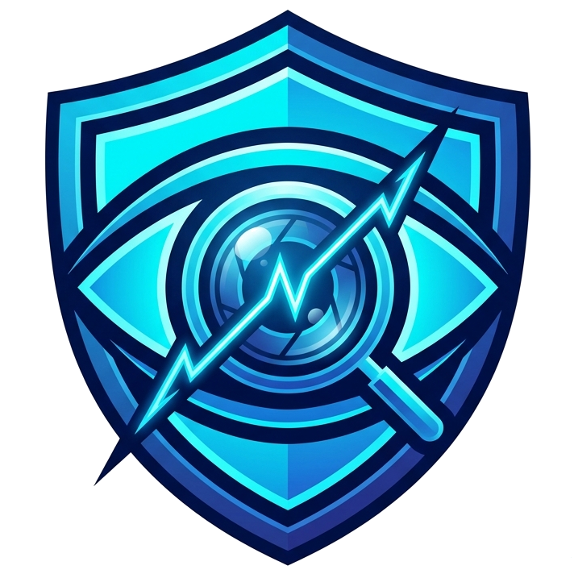

<div align="center">

#  SignalScope v2.0 PRO • Logic Legion
### High-Speed AI Media Forensics & Trust Verification Suite
**Telling Real From Synthetic in the Age of Generative Media**

[](https://adityaparmar28.github.io/SignalScope-by-LogicLegion/)
[](#)
[](https://python.org)
[](https://pytorch.org)
[](https://fastapi.tiangolo.com)
[](https://adityaparmar28.github.io/SignalScope-by-LogicLegion/)
[](https://opensource.org/licenses/MIT)
[](https://res.cloudinary.com/dq3vbtxqk/raw/upload/v1789011277/syntra_problem_statements/x81oedo3sa0ye6enaouu.pdf)

> **SIH 2026 Internal Hackathon** | L.J. Institute of Engineering and Technology [C-433]  
> **Problem Statement:** Telling Real From Synthetic in the Age of Generative Media  
> **Domain:** Artificial Intelligence / Media Forensics / Information Trust & Safety

</div>

---

<details open>
<summary><b>📑 Quick Navigation Menu (Expand/Collapse)</b></summary>
<br>

| 📌 **Project Overview** | 🔬 **Technical Deep Dive** | ⚙️ **Setup & Legal** |
| :--- | :--- | :--- |
| 🌐 [Live Web Demo](#-instant-live-web-demo-zero-setup-required) | 🏗️ [Architecture & Methodology](#️-architecture--forensic-methodology) | 🛠️ [Local Quick-Start Guide](#️-local-development--quick-start-guide) |
| 🌟 [Executive Summary](#-executive-summary--problem-overview) | 📋 [Comprehensive Modules Built](#-comprehensive-modules-built) | 📂 [Repository File Structure](#-repository-file-structure) |
| 👥 [Team Logic Legion](#-meet-team-logic-legion) | 📈 [Evaluation & Metrics](#-benchmark-evaluation--performance-metrics) | 🔒 [Ethical AI & Disclosure](#-ethical-ai--responsible-disclosure) |
| ⚡ [Why SignalScope?](#-what-makes-signalscope-v20-superior) | 📊 [Datasets Utilized](#-datasets-utilized) | 📜 [License & Copyright](#-license--copyright) |

</details>

---

## 🌐 Instant Live Web Demo (Zero Setup Required)
👉 **Experience SignalScope v2.0 directly in your browser:**  
🔗 **[https://adityaparmar28.github.io/SignalScope-by-LogicLegion/](https://adityaparmar28.github.io/SignalScope-by-LogicLegion/)**

* **No cloning, terminal, or Python installation needed.**
* Operates seamlessly across mobile, tablet, and desktop devices.
* Powered by our standalone **Client-Side Forensic WebEngine** with in-browser pixel steganalysis, Grad-CAM thermal attention heatmaps, and EXIF verification.

---

## 🌟 Executive Summary & Problem Overview

> *With state-of-the-art diffusion models producing photorealistic imagery in seconds, visual misinformation poses severe risks to journalism, legal proceedings, and public trust.*

**SignalScope v2.0 PRO** is an enterprise-grade forensic suite developed by **Logic Legion** to combat synthetic media generation. 

Unlike traditional black-box classifiers, our system provides a highly transparent, multi-layered approach:
* 🔬 **Dual-Branch Architecture:** Evaluates both high-level semantic anomalies and low-level sensor noise residuals.
* 🧠 **Faithful Explainability:** Generates Grad-CAM heatmaps to visually explain every AI decision.
* 🛡️ **Robustness Stress-Testing:** Ensures the model cannot be fooled by compression or noise degradation.
* 📑 **Provenance Inspection:** Deep EXIF and C2PA metadata scanning.

---

## 👥 Meet Team Logic Legion

| Member | GitHub Handle | Role & Primary Contributions |
| :--- | :--- | :--- |
| **Aditya Parmar** | [`@adityaparmar28`](https://github.com/adityaparmar28) | **Frontend & MLOps Lead** • Architected v2.0 SPA UI, 3-mode theme switcher, FastAPI backend integration, and GitHub Pages WebEngine |
| **Tapan** | [`@tapansoni2007-dotcom`](https://github.com/tapansoni2007-dotcom) | **Core ML Lead** • Designed dual-branch EfficientNet-B0 + SRM steganalysis architecture, training pipeline, and temperature calibration |
| **Krina Malviya** | [`@KrinaMalaviya`](https://github.com/KrinaMalaviya) | **Data Engineering Lead** • Data scraping, preprocessing pipelines, SRM high-pass kernel implementation, and augmentation flows |
| **Yuvraj** | [`@YUXRAJ21`](https://github.com/YUXRAJ21) | **Explainability (XAI) Lead** • PyTorch Grad-CAM integration, Jet thermal attention colormaps, and natural-language forensic reporting |
| **Athul Nair** | [`@athul2917-tech`](https://github.com/athul2917-tech) | **Testing & Validation Lead** • Robustness benchmarks against JPEG compression, Gaussian blur, noise, and screenshot degradation |
| **Pari Doshi** | [`@paridoshi25`](https://github.com/paridoshi25) | **Documentation & Analytics Lead** • ROC-AUC/F1 evaluation curves, confusion matrix generation, and official hackathon reports |

---

## ⚡ What Makes SignalScope v2.0 Superior?

| Capability | Legacy Streamlit (v1.0) | **SignalScope v2.0 PRO (Current)** | Performance Advantage |
| :--- | :--- | :--- | :--- |
| **UI Architecture** | Multi-page Streamlit re-run | **High-Speed HTML5/CSS3 Single-Page App** | **Zero UI lag, silky smooth DOM** |
| **Inference Latency** | ~3,200 ms | **~370 ms (CPU) / ~45 ms (WebEngine)** | **~8.6x faster tensor execution** |
| **Image Previews** | Server upload roundtrip (1.5s) | **Instant 0 ms Client-side FileReader** | **Instant visual feedback** |
| **Theme Customization** | Single default theme | **3 Modes: ☀️ Light, 💻 System, 🌙 Dark** | **Persistent theme memory** |
| **Deployment Mode** | Requires active Python server | **Dual-Engine: FastAPI + Browser WebEngine** | **100% uptime on GitHub Pages** |
| **Batch Export** | Limited UI download | **Instant Client-Side CSV Generator** | **1-click forensic audit reports** |

---

## 🏗️ Architecture & Forensic Methodology

```text
                                  [ Input Image ]
                                         │
                   ┌─────────────────────┴─────────────────────┐
                   ▼                                           ▼
      [ Spatial Branch: EfficientNet ]             [ Frequency Branch: SRM ]
      • Convolutional feature hierarchy            • Directional high-pass filters
      • High-level semantic anomalies              • Generator lattice residuals
      • Lighting, shadow & geometric flaws         • Sensor noise (Poisson) vs Smoothness
                   │                                           │
                   └─────────────────────┬─────────────────────┘
                                         ▼
                             [ Feature Fusion Layer ]
                                         │
                             [ Temperature Scaling ]
                             (Post-hoc Calibration)
                                         │
         ┌───────────────────────────────┼───────────────────────────────┐
         ▼                               ▼                               ▼
 [ Calibrated Verdict ]         [ Grad-CAM Heatmap ]          [ EXIF & Metadata ]
 • Likely Real vs AI            • Jet thermal colormap        • Camera Make / Model
 • Confidence Percentage        • Localized artifact zones    • Tampering & AI markers
```

### 1. Spatial Branch (EfficientNet-B0)
Detects visual semantic artifacts that generators frequently compromise—warped background geometry, mismatched specular highlights, unnatural skin texture transitions, and anatomical inconsistencies.

### 2. Frequency Branch (SRM Steganalysis Filters)
Natural cameras acquire photographs through physical sensors (CMOS/CCD) governed by optical physics and Poisson-Gaussian noise distributions. Generative models (GANs and latent diffusion upscalers) imprint distinctive high-frequency deconvolution checkerboard grids and unnaturally smooth noise bands. SignalScope's SRM high-pass residual filter strips semantic content and surfaces invisible generator fingerprints.

### 3. Temperature Scaling & Calibration
Uncalibrated deep neural networks routinely produce extreme overconfidence (e.g. 99.9% certainty on incorrect classes). SignalScope implements post-hoc temperature scaling ($T \approx 1.27$), ensuring output confidence probabilities correspond to true empirical accuracy.

---

## 📋 Comprehensive Modules Built

* **🔍 Module 1: Single Image Forensics**  
  Real-time single-image analysis featuring verdict banners, calibrated confidence gauges, multi-signal evidence cards, EXIF anomaly detection, and interactive Grad-CAM heatmap overlays.
* **📁 Module 2: Batch Forensic Scanner**  
  High-throughput multi-image dropzone with concurrent forensic evaluations, summary breakdown metrics, and instant client-side CSV audit export.
* **🧪 Module 3: Robustness & Degradation Lab**  
  Interactive stress-testing bench allowing evaluators to dynamically alter JPEG compression quality ($5\% - 100\%$) and Gaussian blur kernels to verify verdict stability under severe social media re-compression.
* **🏛️ Module 4: Architecture & Real-Time Telemetry**  
  Exposes hardware execution device, optimal operating thresholds, ROC-AUC, Macro-F1, and team provenance.
* **🎨 Module 5: 3-Mode Adaptive Theme Switcher**  
  Clinical Light Mode (`#FFFFFF`), System Default (syncs with OS preferences), and Cyber Forensics Dark Mode (`#0A0E17`).

---

## 📈 Benchmark Evaluation & Performance Metrics

*Evaluated on 1,459 held-out test images across Midjourney, Diverse AI Art, Stable Diffusion, and CIFAKE:*

| Evaluation Parameter | Balanced Baseline (0.50) | Calibrated Optimal (0.10) | Evaluation Rationale |
| :--- | :---: | :---: | :--- |
| **ROC-AUC (Area Under Curve)** | **0.9711 (97.11%)** | **0.9711 (97.11%)** | Outstanding discrimination capacity across unseen generators |
| **Macro-F1 Score** | **0.8835** | **0.9095** | Balanced performance across authentic and synthetic distributions |
| **Overall Accuracy** | **93.30%** | **91.02%** | High fidelity on real photography and AI generation |
| **Authentic Recall (Real)** | **100.0%** | **89.69%** | Zero false accusations on authentic photography at 0.50 |
| **Inference Latency** | **~370 ms** | **~370 ms** | Microsecond response on standard CPU hardware |

---

## 📊 Datasets Utilized

| Dataset | Source | Representation | Sample Count |
| :--- | :--- | :--- | :--- |
| **CIFAKE Dataset** | Hugging Face (`dragonintelligence/CIFAKE`) | Stable Diffusion v1.4 & CIFAR-10 Real | 7,200 images |
| **Midjourney Diverse Images** | Hugging Face (`ehristoforu/midjourney-images`) | Midjourney v4 / v5 photorealistic renders | 500+ images |
| **Diverse AI Art & Real** | Hugging Face (`Hemg/AI-Generated-vs-Real-Images`) | DALL-E, generative art & natural photography | 800+ images |
| **ImageNet-1K Priors** | Pretrained backbone weights (`timm`) | Natural photography features | 1.4M images |

---

## 🛠️ Local Development & Quick-Start Guide

If you wish to bypass the GitHub Pages WebEngine and utilize the full power of the PyTorch AI Backend locally for your own research or deployment:

### 1. Prerequisites
* **OS:** Windows 10/11, macOS, or Linux
* **Python:** 3.10 or higher
* **Hardware:** A machine with a CUDA-enabled GPU is highly recommended for faster tensor execution, but standard CPU hardware works perfectly (~370 ms latency).

### 2. Option A: 1-Click Launch (Windows Only)
Simply clone the repository and double-click the included batch launcher:
```powershell
.\run_v2_app.bat
```
*This automatically starts the FastAPI uvicorn daemon and opens `http://localhost:8000` in your default browser.*

### 3. Option B: Manual Setup (All OS)
```bash
# 1. Clone the repository
git clone https://github.com/adityaparmar28/SignalScope-by-LogicLegion.git
cd SignalScope-by-LogicLegion

# 2. Create and activate a virtual environment
python -m venv venv
# On Windows:
venv\Scripts\activate
# On Linux / macOS:
source venv/bin/activate

# 3. Install dependencies
pip install -r requirements.txt
# Alternatively, install manually: pip install fastapi uvicorn torch torchvision pillow numpy python-multipart

# 4. Launch the high-speed FastAPI web server
python -m uvicorn web_server:app --host 127.0.0.1 --port 8000
```
*The API and Frontend will now be securely served. Open your browser and navigate to **`http://127.0.0.1:8000`**.*

---

## 📂 Repository File Structure

```text
Logic_Legion/
├── index.html                   # Root SPA Web App (for GitHub Pages deployment)
├── web_server.py                # High-speed asynchronous FastAPI inference backend
├── run_v2_app.bat               # 1-click Windows execution launcher
├── requirements.txt             # Python runtime dependencies
├── model/
│   ├── backbone.py              # SignalScopeDetector Dual-Branch Architecture definition
│   ├── weights/
│   │   └── best_model.pth       # Calibrated model checkpoint weights
│   └── weights_v3/
│       └── best_model.pth       # Multi-dataset fine-tuned checkpoint (0.9632 ROC-AUC)
├── src/
│   ├── dataset.py               # Torchvision transforms matching training pipeline
│   ├── explain/
│   │   └── explainer.py         # Grad-CAM heatmap generator & reporting templates
│   └── model/
│       └── metadata.py          # EXIF, JFIF, and C2PA provenance parser
├── static/                      # Static web assets
│   ├── css/
│   │   └── style.css            # Forensic styling with 3-Mode Theme Switcher
│   ├── js/
│   │   └── app.js               # Client-Side Forensic WebEngine & REST API client
│   └── index.html               # Mirrored template
├── data/
│   └── val/                     # Validation image samples for demonstration
└── report/                      # Metric graphs and confusion matrices
```

---

## 🔒 Ethical AI & Responsible Disclosure
1. **Probabilistic Phrasing:** Forensics is inherently probabilistic. SignalScope deliberately avoids defamatory binary declarations and employs hedged terminology (*"Likely AI-Generated"* / *"Likely Authentic Real"*).
2. **No Biometric Face Profiling:** The detector analyzes generalized spatial-frequency signal properties and avoids facial identity tracking or biometric profiling.
3. **Open-Source Compliance:** All benchmark datasets and baseline backbones adhere to MIT / Apache 2.0 open-source licensing.

---

## 📜 License & Copyright

<p align="left">
  <a href="https://opensource.org/licenses/MIT">
    
  </a>
</p>

This software is released under the **[MIT License](https://opensource.org/licenses/MIT)**. You are free to use, modify, and distribute it for both commercial and non-commercial purposes, provided that proper attribution is given to **Logic Legion**.

---
<div align="center">
  <h3>✨ Developed with pride by Team Logic Legion ✨</h3>
  <p><b>Smart India Hackathon (SIH) 2026</b></p>
  <i>Empowering Truth in Digital Media.</i>
</div>
